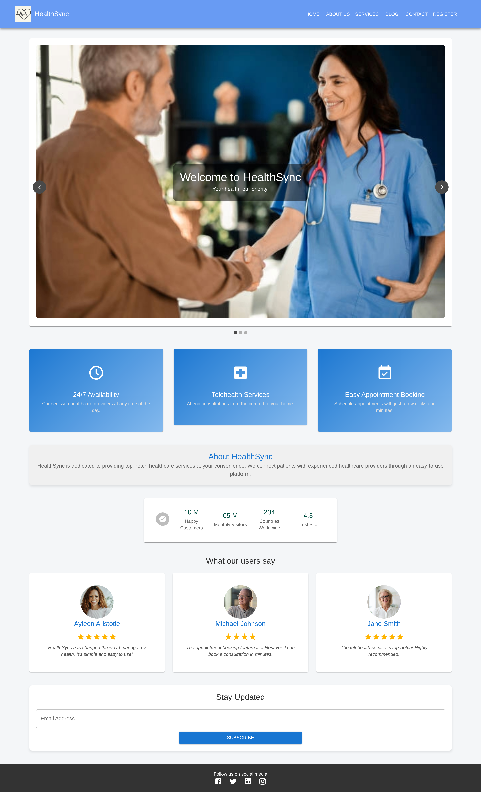
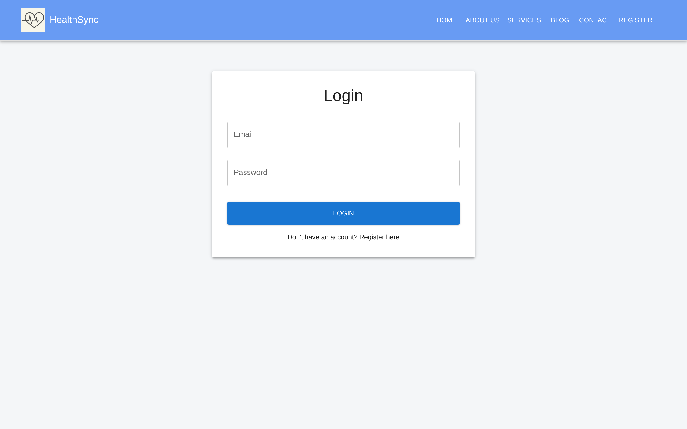
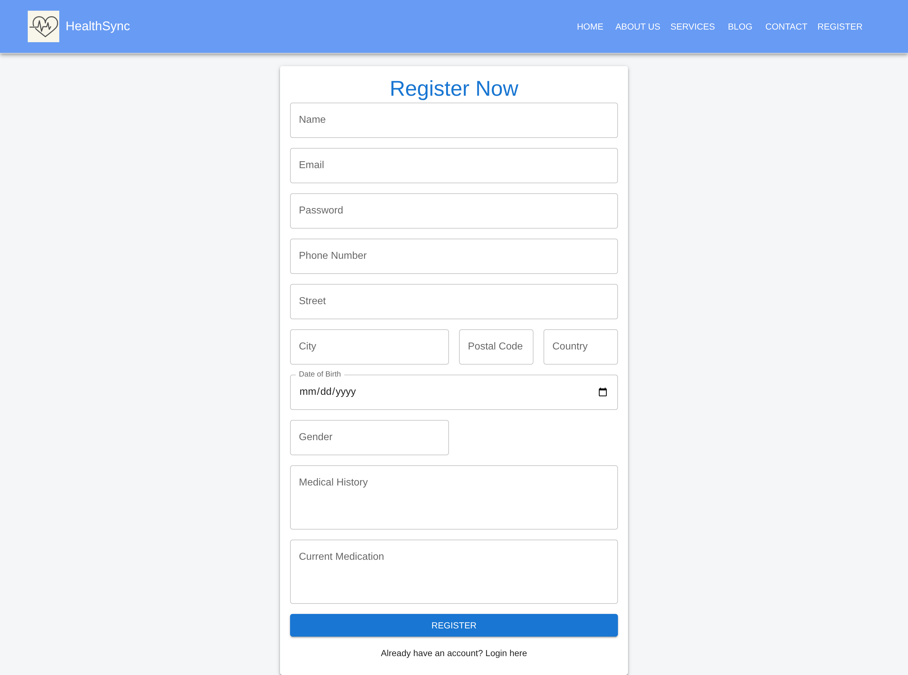
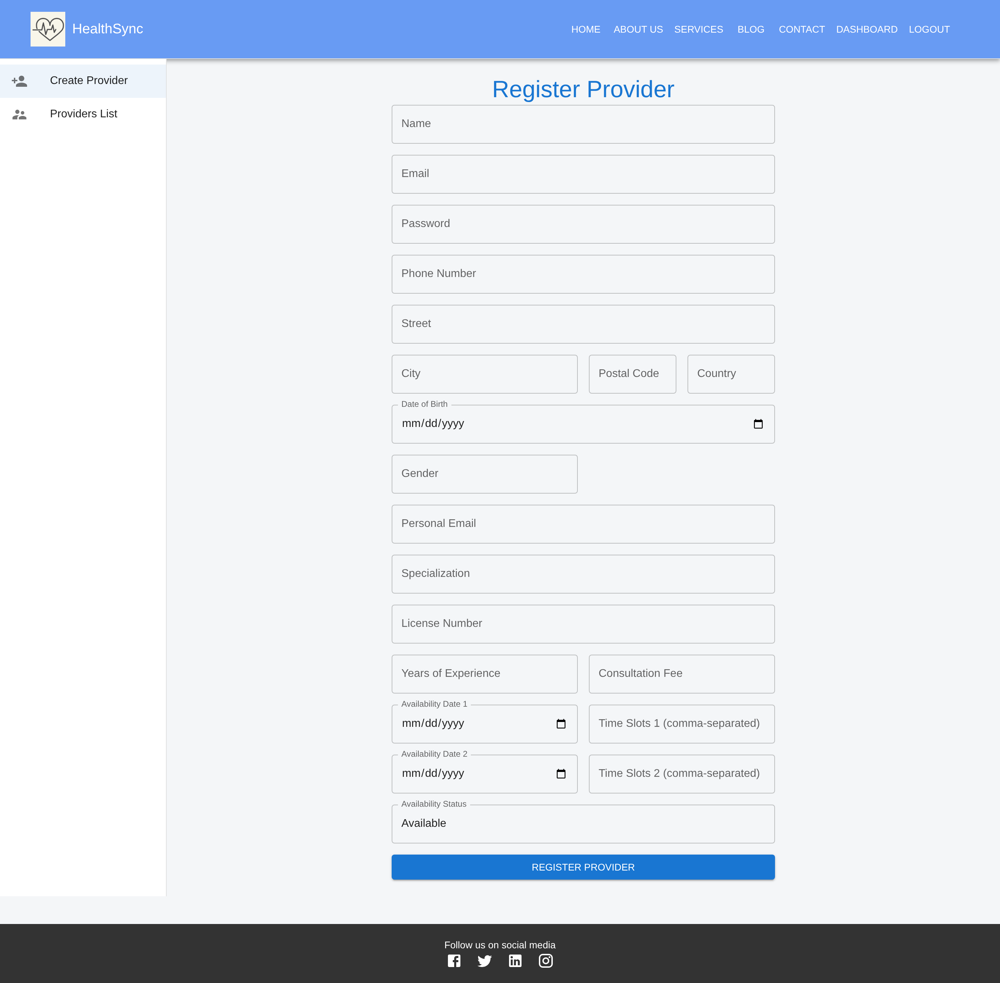
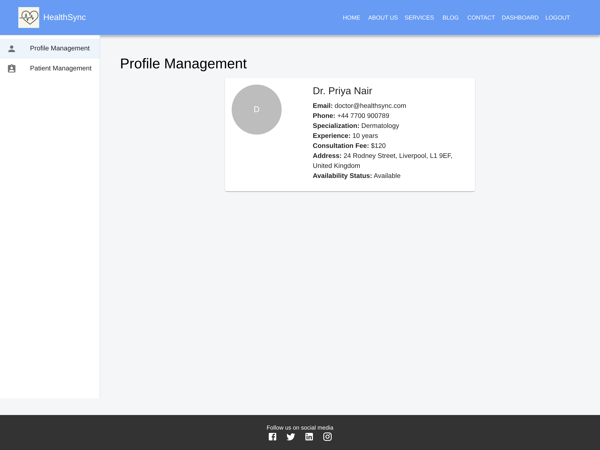
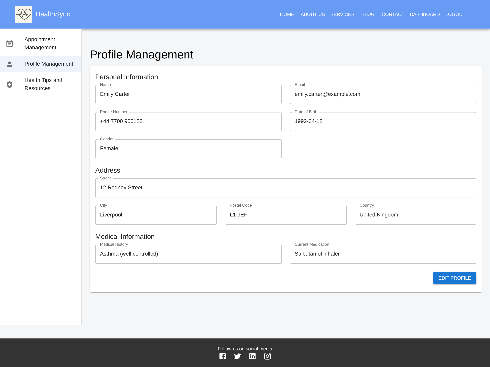
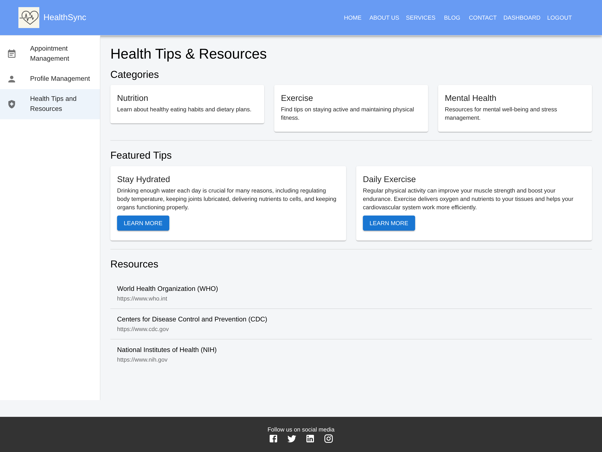

# HealthSync Scheduler 🏥

> A serverless telehealth appointment scheduling platform built to streamline medical appointment booking and enable scalable, low-cost telehealth access. Developed as my MSc dissertation project at the University of Liverpool (2024).


## Overview

HealthSync Scheduler lets patients find nearby healthcare providers, book appointments, and receive automated confirmations and reminders, without the platform needing a persistent server tier. The entire backend runs on AWS Lambda with DynamoDB storage, so the system scales to zero when idle and handles bursts of demand cost-efficiently, a key requirement for telehealth services with unpredictable load.

## Key features

- **Appointment scheduling** - patients browse provider availability and book, reschedule or cancel appointments through a React single-page application
- **Provider location services** - Google Maps API integration to find and display nearby healthcare providers
- **Automated patient notifications** - AWS SES (email) and SNS (SMS) send booking confirmations and appointment reminders without manual intervention
- **Serverless architecture** - all business logic in AWS Lambda functions behind API Gateway, with DynamoDB as the data store; no servers to provision or patch

## Screenshots

### Landing page



### Authentication

| Login | Patient registration |
|---|---|
|  |  |

### Role-based dashboards

**Admin — register and manage providers**



**Provider — profile management**



**Patient — profile and health resources**

| Profile management | Health tips & resources |
|---|---|
|  |  |

## Architecture

```
React SPA ──► API Gateway ──► AWS Lambda ──► DynamoDB
                                  │
                                  ├──► AWS SES  (email confirmations)
                                  ├──► AWS SNS  (SMS reminders)
                                  └──► Google Maps API (provider locations)
```

**Why serverless?** Telehealth demand is spiky and unpredictable. Pay-per-invocation Lambda plus on-demand DynamoDB keeps costs near zero at low usage while scaling automatically under load, demonstrating a cost-efficient pattern for health-tech services that cannot justify an always-on server fleet.

## Tech stack

| Layer | Technology |
|---|---|
| Frontend | React (SPA) |
| Compute | AWS Lambda + API Gateway |
| Database | Amazon DynamoDB |
| Notifications | AWS SES (email), AWS SNS (SMS) |
| Maps | Google Maps API |

## Running locally

```bash
# Install dependencies
npm install

# Configure environment
# Add AWS credentials and Google Maps API key to .env

# Run the frontend
npm start
```

## Context

Built as the dissertation project for my MSc in Advanced Computer Science at the University of Liverpool (graduated 2024, Merit). The project was designed to demonstrate cost-efficient scaling for telehealth without a persistent server tier.

## Licence

MIT
